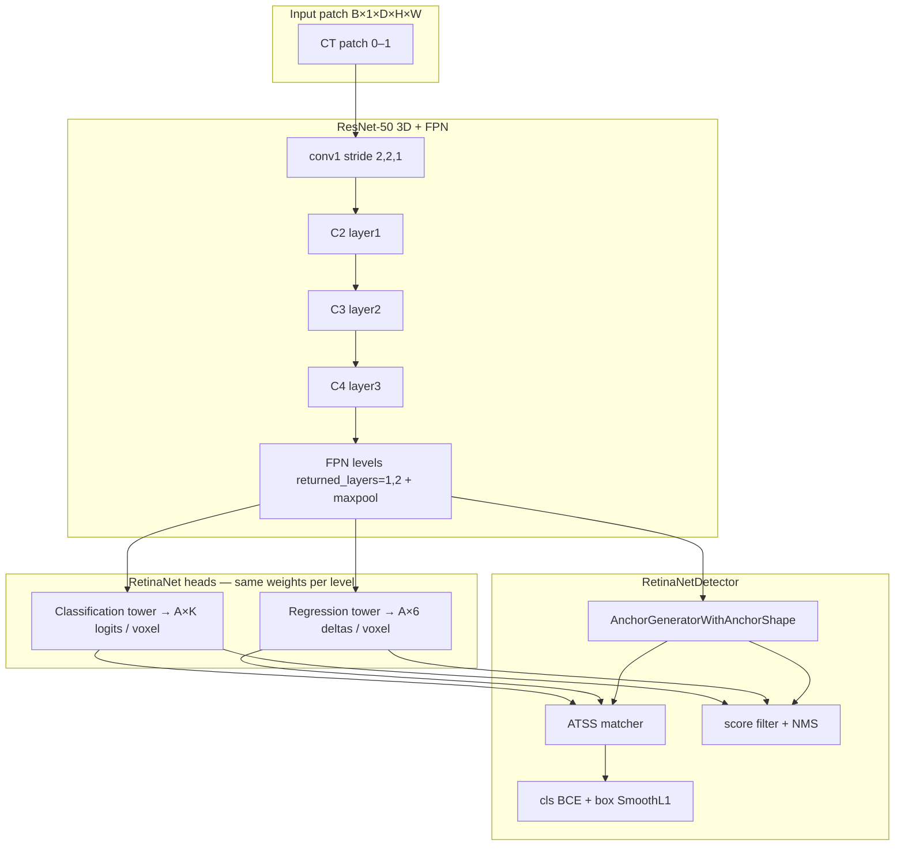

---
jupyter:
  jupytext:
    text_representation:
      extension: .md
      format_name: markdown
      format_version: '1.3'
      jupytext_version: 1.19.3
  kernelspec:
    display_name: Python 3 (ipykernel)
    language: python
    name: python3
---


# RetinaNet network internals — LUNA16 / `luna16_training2.py`

This notebook walks through the **detection network stack** wired up in
[`luna16_training2.py`](../det3d/detection/luna16_training2.py): anchors, FPN backbone, RetinaNet heads,
matching, losses, and inference post-processing.

It does **not** repeat the data-transform pipeline (see
[`luna16_transform_journey.ipynb`](../det3d/detection/luna16_transform_journey.ipynb) for that).

## Primary references

| Paper | Role in this code |
|-------|-------------------|
| [Focal Loss for Dense Object Detection (RetinaNet)](https://arxiv.org/abs/1708.02002) — Lin et al., ICCV 2017 | One-stage anchor-based detector; classification + box-regression subnetworks on FPN features |
| [Feature Pyramid Networks](https://arxiv.org/abs/1612.03144) — Lin et al., CVPR 2017 | Multi-scale feature maps `{P2, P3, …}` fed to both heads |
| [Bridging the Gap Between Anchor-based and Anchor-free (ATSS)](https://arxiv.org/abs/1912.02424) — Zhang et al., CVPR 2020 | Adaptive anchor–GT matching used here instead of fixed IoU thresholds |

MONAI implements 3D RetinaNet by extending [torchvision's RetinaNet](https://github.com/pytorch/vision/blob/main/torchvision/models/detection/retinanet.py).

## Roadmap

1. Hyperparameters copied from `luna16_training2.py`
2. **Anchors** — what they are, how many, where they sit
3. **Backbone + FPN** — ResNet-50 → pyramid levels
4. **RetinaNet heads** — shared conv towers → cls / reg maps
5. **Detector wrapper** — forward pass, matching, losses, NMS
6. Shape inspection on a synthetic 3D patch


## Architecture at a glance



**Key idea (RetinaNet paper):** at every spatial location on every FPN level, predict
(a) object class logits for `A` anchor shapes and (b) box refinements that map each anchor
to a final box. Training uses dense predictions + focal-style imbalance handling; this
MONAI port uses **BCEWithLogitsLoss** + **hard-negative sampling** instead of the paper's
sigmoid focal loss by default.

```python
import sys
from pathlib import Path

repo = Path("/home/ub/code/det3d")
if str(repo) not in sys.path:
    sys.path.insert(0, str(repo))

import math
import torch
import torch.nn as nn
import numpy as np
import matplotlib.pyplot as plt

from monai.apps.detection.networks.retinanet_detector import RetinaNetDetector
from monai.apps.detection.networks.retinanet_network import (
    RetinaNet,
    resnet_fpn_feature_extractor,
)
from monai.apps.detection.utils.anchor_utils import AnchorGeneratorWithAnchorShape
from monai.networks.nets import resnet

device = torch.device("cuda" if torch.cuda.is_available() else "cpu")
print(f"device={device}, torch={torch.__version__}")
```

## 1 — Hyperparameters from `luna16_training2.py`

These constants drive anchor sizes, FPN depth, and detector behaviour.

```python
# Copied from luna16_training2.py (lines 84–110)
spatial_dims = 3
n_input_channels = 1
fg_labels = [0]                     # single class: nodule
returned_layers = [1, 2]            # FPN pulls C3, C4 + extra maxpool level
conv1_t_stride = [2, 2, 1]
base_anchor_shapes = [[6, 8, 4], [8, 6, 5], [10, 10, 6]]  # mm-ish at network resolution
patch_size = [192, 192, 80]         # training crop (D,H,W) after transforms
score_thresh = 0.02
nms_thresh = 0.22
balanced_sampler_pos_fraction = 0.3
w_cls = 1.0

print("returned_layers:", returned_layers)
print("num FPN levels:", len(returned_layers) + 1)
print("anchors per location:", len(base_anchor_shapes))
```

<!-- #region -->
## 2 — Anchors

### What is an anchor?

An **anchor** is a fixed prior box placed on the image grid. The network does not predict
absolute boxes directly; it predicts **deltas** that refine each anchor into a detection box.

RetinaNet (Sec. 4.1) uses anchors at multiple scales and aspect ratios on each FPN level.
MONAI's `AnchorGeneratorWithAnchorShape` generalises this to 3D with explicit `[w, h, d]` shapes.

### Anchor box in standard mode

For centre \((c_x, c_y, c_z)\) and shape \((w, h, d)\), the anchor corners are

$$
x_\min = c_x - \tfrac{w}{2},\quad x_\max = c_x + \tfrac{w}{2}
$$

(and similarly for \(y, z\)). Stored as `[x_min, y_min, z_min, x_max, y_max, z_max]`.

### Per-level scaling

In `luna16_training2.py`:

```python
feature_map_scales = [2**l for l in range(len(returned_layers) + 1)]  # → [1, 2, 4]
```

Level \(l\) anchor shape = `scale[l] * base_anchor_shapes[j]` for each of the 3 base shapes.
Coarser FPN levels get **larger** anchors → multi-scale coverage without changing the head.

### Count

If level \(i\) has feature map size \(H_i \times W_i \times D_i\) and \(A =\) `len(base_anchor_shapes)`:

$$
N_\text{anchors} = \sum_i H_i W_i D_i \cdot A
$$

For `patch_size = [192,192,80]` this is ~hundreds of thousands of anchors — most are background.
<!-- #endregion -->

```python
anchor_generator = AnchorGeneratorWithAnchorShape(
    feature_map_scales=[2**l for l in range(len(returned_layers) + 1)],
    base_anchor_shapes=base_anchor_shapes,
)
num_anchors = anchor_generator.num_anchors_per_location()[0]
print(f"anchors per spatial location A = {num_anchors}")
print(f"base shapes (level 0, scale=1): {base_anchor_shapes}")

scales = [2**l for l in range(len(returned_layers) + 1)]
for lvl, s in enumerate(scales):
    shapes = (s * torch.tensor(base_anchor_shapes)).int().tolist()
    print(f"  FPN level {lvl} (scale={s}): {shapes}")
```

## 3 — Backbone + Feature Pyramid Network

RetinaNet uses a **bottom-up** ResNet and **top-down** FPN (Lin et al. 2017 FPN paper).

| Component | This project |
|-----------|--------------|
| Backbone | `resnet.ResNet` Bottleneck `[3,4,6,3]` (ResNet-50 depth) |
| Input stride | `conv1_t_stride = [2,2,1]` — downsamples D×H by 2, W by 2, D by 1 |
| FPN levels | `returned_layers = [1,2]` → 3 outputs (C3, C4, + max-pooled P6) |
| Channels | 256 per FPN level (`out_channels` on feature extractor) |

**Size divisibility:** input spatial size must be divisible by

$$
\text{size\_divisible}_k = \text{conv1\_stride}_k \cdot 2 \cdot 2^{\max(\text{returned\_layers})}
$$

With `conv1_t_stride=[2,2,1]` and `max(returned_layers)=2` → `(8, 8, 4)` in (D,H,W) order
(MONAI uses `[C, D, H, W]` layout for 3D).

```python
conv1_t_size = [max(7, 2 * s + 1) for s in conv1_t_stride]
backbone = resnet.ResNet(
    block=resnet.ResNetBottleneck,
    layers=[3, 4, 6, 3],
    block_inplanes=resnet.get_inplanes(),
    n_input_channels=n_input_channels,
    conv1_t_stride=conv1_t_stride,
    conv1_t_size=conv1_t_size,
)
feature_extractor = resnet_fpn_feature_extractor(
    backbone=backbone,
    spatial_dims=spatial_dims,
    pretrained_backbone=False,
    trainable_backbone_layers=None,
    returned_layers=returned_layers,
)
size_divisible = [
    s * 2 * 2 ** max(returned_layers) for s in feature_extractor.body.conv1.stride
]
print("conv1 stride:", feature_extractor.body.conv1.stride)
print("size_divisible (D,H,W):", size_divisible)
print("FPN out_channels:", feature_extractor.out_channels)
```

## 4 — RetinaNet heads

From the RetinaNet paper (Fig. 3): two **identical-in-structure** subnetworks (one cls, one reg),
each with 4×3×3 conv layers, applied **separately to each FPN level** with shared weights across levels.

MONAI (`RetinaNetClassificationHead` / `RetinaNetRegressionHead`):

- 4 × (Conv3×3×3 → GroupNorm(8) → ReLU)
- Final 1×1 conv:
  - **cls:** `A × K` channels (`K = num_classes`, here K=1)
  - **reg:** `A × 2 × spatial_dims` channels (6 for 3D: Δcx,Δcy,Δcz,Δlog w,Δlog h,Δlog d)

Classification bias init uses prior probability \(p=0.01\):

$$
b = -\log\frac{1-p}{p}
$$

so initial sigmoid outputs are ~0.01 — appropriate when positives are rare among anchors.

```python
net = RetinaNet(
    spatial_dims=spatial_dims,
    num_classes=len(fg_labels),
    num_anchors=num_anchors,
    feature_extractor=feature_extractor,
    size_divisible=size_divisible,
)
net = net.to(device)

prior_p = 0.01
expected_bias = -math.log((1 - prior_p) / prior_p)
actual_bias = net.classification_head.cls_logits.bias[0].item()
print(f"cls head bias init: {actual_bias:.3f} (expected {expected_bias:.3f})")
print(f"reg head output dim per anchor: {2 * spatial_dims}")
```

## 5 — RetinaNetDetector: wiring training + inference

`RetinaNetDetector` wraps `net` and adds everything the raw network does not do:

| Step | Training | Inference |
|------|----------|------------|
| Preprocess | Pad to `size_divisible` | Same |
| Forward | `net(images)` → cls/reg maps | Same (+ optional sliding window) |
| Anchors | `anchor_generator(images, feature_maps)` | Same |
| Reshape | `(B, A×K, d,h,w)` → `(B, ΣHWDA, K)` | Same |
| Match | ATSS: anchor ↔ GT | — |
| Sample | Hard-negative sampler (64/img, 30% pos) | — |
| Loss | BCE cls + SmoothL1 reg | — |
| Post | — | sigmoid → decode boxes → NMS |

This mirrors `luna16_training2.py` lines 260–286.

```python
detector = RetinaNetDetector(
    network=net, anchor_generator=anchor_generator, debug=False
).to(device)

detector.set_atss_matcher(num_candidates=4, center_in_gt=False)
detector.set_hard_negative_sampler(
    batch_size_per_image=64,
    positive_fraction=balanced_sampler_pos_fraction,
    pool_size=20,
    min_neg=16,
)
detector.set_target_keys(box_key="box", label_key="label")
detector.set_box_selector_parameters(
    score_thresh=score_thresh,
    topk_candidates_per_level=1000,
    nms_thresh=nms_thresh,
    detections_per_img=100,
)

print("cls loss:", type(detector.cls_loss_func).__name__)
print("box loss:", type(detector.box_loss_func).__name__)
print("matcher:", type(detector.proposal_matcher).__name__)
```

## 6 — Forward pass: tensor shapes

Run the **network head only** on a random patch with the same shape as training crops.
No LIDC data required.

```python
D, H, W = patch_size
# pad to size_divisible
pad_d = (size_divisible[0] - D % size_divisible[0]) % size_divisible[0]
pad_h = (size_divisible[1] - H % size_divisible[1]) % size_divisible[1]
pad_w = (size_divisible[2] - W % size_divisible[2]) % size_divisible[2]
D2, H2, W2 = D + pad_d, H + pad_h, W + pad_w
print(f"patch {patch_size} → padded ({D2},{H2},{W2}), pad=({pad_d},{pad_h},{pad_w})")

images = torch.rand(1, 1, D2, H2, W2, device=device)
net.eval()
with torch.no_grad():
    head = net(images)

print("\nFPN levels:", len(head["classification"]))
for i, (cls_m, reg_m) in enumerate(zip(head["classification"], head["box_regression"])):
    _, c_cls, *spatial = cls_m.shape
    _, c_reg, *spatial2 = reg_m.shape
    n_vox = int(np.prod(spatial))
    print(
        f"  level {i}: spatial={tuple(spatial)}, "
        f"cls channels={c_cls} (=A×K={num_anchors}×{len(fg_labels)}), "
        f"reg channels={c_reg} (=A×6={num_anchors}×6), "
        f"anchors at level={n_vox * num_anchors}"
    )

detector.eval()
with torch.no_grad():
    detector.generate_anchors(images, head)
anchors = detector.anchors[0]
print(f"\ntotal anchors: {anchors.shape[0]}  (each row is 6-d standard box)")
```

## 7 — Box encoding (regression targets)

RetinaNet Eqn. (1) (centre-size parameterisation). Given anchor \((c_x^a, c_y^a, c_z^a, w^a, h^a, d^a)\)
and ground-truth \((c_x, c_y, c_z, w, h, d)\):

$$
t_x = \frac{c_x - c_x^a}{w^a},\quad
t_y = \frac{c_y - c_y^a}{h^a},\quad
t_z = \frac{c_z - c_z^a}{d^a}
$$

$$
t_w = \log\frac{w}{w^a},\quad
t_h = \log\frac{h}{h^a},\quad
t_d = \log\frac{d}{d^a}
$$

**Decode** (inference): invert with predicted deltas + `BoxCoder.decode_single`.

Loss: Smooth L1 on encoded targets for matched anchors only (`encode_gt=True`).

```python
from monai.data.box_utils import convert_box_mode, StandardMode, CenterSizeMode

# pick one anchor and synthesise a nearby GT box
anchor = anchors[1000:1001].clone()
gt = anchor.clone()
gt_cccwhd = convert_box_mode(gt, StandardMode, CenterSizeMode)
gt_cccwhd[0, :3] += torch.tensor([2.0, -1.0, 0.5])  # shift centre
gt_cccwhd[0, 3:] *= 1.1                           # scale up 10%
gt = convert_box_mode(gt_cccwhd, CenterSizeMode, StandardMode)

encoded = detector.box_coder.encode_single(gt, anchor)
decoded = detector.box_coder.decode_single(encoded, anchor)
print("anchor (std):", anchor[0].tolist())
print("gt       (std):", gt[0].tolist())
print("encoded t:", encoded[0].tolist())
print("decode round-trip max err:", (decoded - gt).abs().max().item())
```

## 8 — ATSS matching

Classic RetinaNet uses IoU thresholds (e.g. ≥0.5 positive, <0.4 negative).
**ATSS** (Zhang et al. 2020) adapts the threshold per GT object:

1. For each FPN level, take `num_candidates=4` anchors closest to each GT centre
2. Pool candidates across levels → compute IoU with GT
3. Threshold = `mean(IoU) + std(IoU)`; anchors above it are positives

`center_in_gt=False` (LUNA16 setting) allows anchors whose **centre** lies outside the nodule —
important for tiny lesions where strict centre-in-box matching would leave too few positives.

Matched index per anchor:
- `≥ 0` → index of matched GT
- `-1` → below threshold (background for cls)
- `-2` → between thresholds (ignored in sampling when using balanced sampler)

```python
detector.train()
# one synthetic nodule box inside the patch (standard mode xyzxyz)
cx, cy, cz = W2 // 2, H2 // 2, D2 // 2
gt_box = torch.tensor(
    [[cx - 5, cy - 6, cz - 3, cx + 5, cy + 6, cz + 3]],
    dtype=torch.float32,
    device=device,
)
targets = [{"box": gt_box, "label": torch.tensor([0], device=device)}]

with torch.no_grad():
    head = net(images)
    detector.generate_anchors(images, head)
    num_locs = [m.shape[2:].numel() for m in head["classification"]]
    matched = detector.compute_anchor_matched_idxs(detector.anchors, targets, num_locs)

pos = (matched[0] >= 0).sum().item()
neg = (matched[0] == -1).sum().item()
ign = (matched[0] == -2).sum().item()
print(f"matched anchors: pos={pos}, neg(ignored band)={ign}, background={neg}")
print(f"GT box volume ~ {(2*5)*(2*6)*(2*3)} voxels")
```

## 9 — Training loss (one step)

Total loss in `luna16_training2.py`:

$$
\mathcal{L} = w_{\text{cls}} \cdot \mathcal{L}_{\text{cls}} + \mathcal{L}_{\text{box}}
$$

Classification uses **multi-label BCE** on one-hot targets (single class here).
The RetinaNet paper's **focal loss** down-weights easy negatives:

$$
FL(p_t) = -\alpha (1-p_t)^\gamma \log(p_t)
$$

MONAI defaults to `BCEWithLogitsLoss` + **hard-negative mining** (`HardNegativeSampler`)
to keep batch size manageable (64 anchors/image, 30% positive).

Optional: `detector.set_cls_loss(FocalLoss(gamma=2.0))` to match the paper more closely.

```python
detector.train()
outputs = detector(images, targets)
loss = w_cls * outputs[detector.cls_key] + outputs[detector.box_reg_key]
print({k: float(v) for k, v in outputs.items()})
print(f"total loss = {loss.item():.4f}")
```

## 10 — Inference: decode + NMS

At test time (`detector.eval()`), forward returns a list of dicts per image:

1. Apply sigmoid to cls logits
2. Filter `score < score_thresh` (0.02 here — low because single-class sigmoid)
3. Keep top-1000 per level
4. Decode reg deltas → boxes
5. **NMS** with IoU threshold `nms_thresh=0.22`
6. Keep top 100 detections

Large volumes use `set_sliding_window_inferer(roi_size=val_patch_size, overlap=0.25)`
as in validation in `luna16_training2.py`.

```python
detector.eval()
with torch.no_grad():
    preds = detector(images)

p = preds[0]
print("prediction keys:", list(p.keys()))
print("num detections:", p["box"].shape[0])
if p["box"].shape[0] > 0:
    top = p["label_scores"].argsort(descending=True)[:5]
    for i in top:
        print(f"  score={p['label_scores'][i]:.3f} box={p['box'][i].tolist()}")
```

## 11 — Visualise anchors on one 2D slice (optional)

Project anchors onto the middle axial slice to see multi-scale coverage.
Only a subsample is drawn for clarity.

```python
z_mid = D2 // 2
mask = (anchors[:, 2] <= z_mid) & (anchors[:, 5] >= z_mid)  # z_min, z_max
slice_anchors = anchors[mask].cpu().numpy()
rng = np.random.default_rng(0)
idx = rng.choice(len(slice_anchors), size=min(200, len(slice_anchors)), replace=False)
slice_anchors = slice_anchors[idx]

fig, ax = plt.subplots(figsize=(7, 7))
ax.set_title(f"Sample anchors on axial slice z={z_mid} (n={len(slice_anchors)})")
ax.set_xlim(0, W2)
ax.set_ylim(H2, 0)
ax.set_aspect("equal")
for a in slice_anchors:
    x0, y0, _, x1, y1, _ = a
    ax.add_patch(plt.Rectangle((x0, y0), x1 - x0, y1 - y0, fill=False, linewidth=0.5, alpha=0.4))
if gt_box.numel():
    g = gt_box[0].cpu().numpy()
    ax.add_patch(plt.Rectangle((g[0], g[1]), g[3]-g[0], g[4]-g[1], fill=False, color="red", linewidth=2, label="GT"))
    ax.legend()
plt.tight_layout()
plt.show()
```

## 12 — Mapping back to `luna16_training2.py`

| Notebook section | Script lines | MONAI module |
|------------------|--------------|--------------|
| Anchors | 224–227 | `AnchorGeneratorWithAnchorShape` |
| Backbone + FPN | 232–247 | `resnet.ResNet`, `resnet_fpn_feature_extractor` |
| RetinaNet | 250–258 | `RetinaNet` |
| Detector config | 261–286 | `RetinaNetDetector` |
| Train step | 364–377 | `detector(inputs, targets)` → cls + box losses |
| Val inference | 437–454 | `detector(val_inputs, use_inferer=True)` |

### Tuning knobs for small nodules

- **`base_anchor_shapes`** — shrink if anchors are larger than typical nodules
- **`returned_layers`** — smaller values → finer FPN levels (more resolution, smaller receptive field)
- **`center_in_gt=False`** — already set; keeps more positive anchors for tiny lesions
- **`score_thresh` / `nms_thresh`** — lower score threshold finds weak detections; tighter NMS reduces duplicates

### Further reading

- RetinaNet paper: https://arxiv.org/abs/1708.02002
- FPN: https://arxiv.org/abs/1612.03144
- ATSS: https://arxiv.org/abs/1912.02424
- MONAI detection tutorial: https://docs.monai.io/en/stable/apps/detection.html
